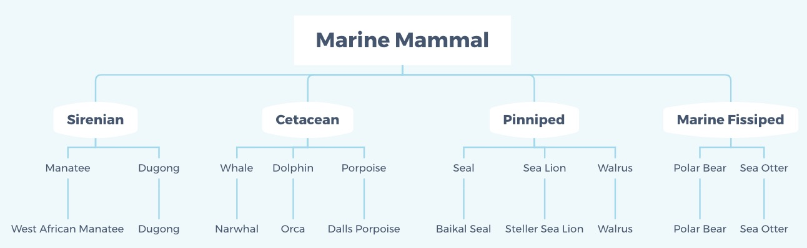

# Benchmarking Large Language Models for Image Classification of Marine Mammals

This dataset contains images of different marine animals that was created to evalute the abilites of LLM in classifing marine mamals.

||
|:--:| 
| Hierarchy class |

#### Dataset overview

|                         | Training set | Validation set | Testing set |
|-------------------------|--------------|----------------|-------------|
| **# images**             | 1163         | 130            | 130         |
| **Min # per species**    | 11           | 2              | 2           |
| **Max # per species**    | 37           | 2              | 2           |
| **# Group classes**      | 4            | 4              | 4           |
| **# Medium classes**     | 10           | 10             | 10          |
| **# Species classes**    | 65           | 65             | 65          |

### Cite
If you can find our project is useful, please cite our paper

```
@article{qi2024benchmarking,
  title={Benchmarking Large Language Models for Image Classification of Marine Mammals},
  author={Qi, Yijiashun and Cai, Shuzhang and Zhao, Zunduo and Li, Jiaming and Lin, Yanbin and Wang, Zhiqiang},
  journal={arXiv preprint arXiv:2410.19848},
  year={2024}
}
```

If you are interested in evaluating the LLM's abilities in guessing image's geolocation, please refer to our another project [LLMGeo](https://github.com/yeyimilk/LLMGeo).